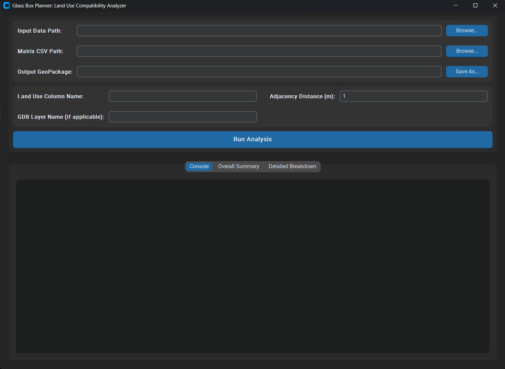

# Glass Box Planner

[](https://opensource.org/licenses/MIT)
[](https://github.com/Kiarash-m0hammadi/glass-box-planner/releases/latest)

A transparent, open-source framework for reproducible land use compatibility analysis, as presented in the paper, *"The Glass Box Planner: An Open-Source Framework for Transparent Pairwise Compatibility Analysis in Urban Planning."*

---

## 📖 Project Rationale

Conventional land use analysis is caught between two problematic extremes: time-consuming manual methods that are difficult to reproduce and scale, and opaque "black box" AI models that discover statistical patterns without reference to explicit policy. This project introduces a third way: the **"Glass Box"** approach.

The Glass Box Planner is not a tool for statistical discovery. It is an instrument for a **systematic policy audit**. It is built on the premise that the core logic of planning—the codified goals, cultural values, and legal precedents of a community—can and should be transparent. This logic is encoded in a human-legible **compatibility matrix**, which serves as the engine's auditable "source code."

The framework's purpose is to hold up a mirror to the city, providing a city-wide, parcel-by-parcel diagnostic of on-the-ground reality versus stated policy intentions. By rejecting the false precision of complex simulations and prioritizing transparency, the tool is designed to structure, not end, democratic debate. It empowers planners, communities, and NGOs to visualize the spatial consequences of different value systems by proposing and testing their own "counter-matrixes," shifting the conversation from an abstract clash of values to a concrete, evidence-based dialogue about the urban future.

This repository provides the full toolset to replicate our research and, more importantly, to apply this "policy-as-code" framework to new cities and new planning challenges.
## Figures

The repository includes illustrative figures in the `docs/images/` folder:


Figure: Heatmap of Land Use Compatibility Matrix. See [`docs/images/Heatmap of Land Use Compatibility Matrix.png`](docs/images/Heatmap of Land Use Compatibility Matrix.png)



Figure: Example GUI screenshot. See [`docs/images/GUI.png`](docs/images/GUI.png)


Figure: Spatial distribution of land use compatibility in Qazvin, Iran.)


## ✨ Key Features

-   **Transparent Logic:** Core analysis is driven by an open, editable CSV compatibility matrix—no black boxes.
-   **Systematic Policy Audit:** Performs a comprehensive, parcel-by-parcel check of policy against reality.
-   **High-Performance:** Uses a vectorized geospatial engine (GeoPandas) to analyze tens of thousands of parcels in seconds.
-   **Accessible:** Includes a user-friendly Graphical User Interface (GUI) with pre-built executables for Windows, macOS, and Linux. No coding required for planners.
-   **Fully Open-Source:** All code, data, and logic are available to ensure full reproducibility and extensibility (MIT License).

## 🚀 Getting Started: For Planners & Practitioners

The easiest way to use the Glass Box Planner is with the pre-built application. No installation or coding is needed.

1.  **Go to the [Releases Page](https://github.com/Kiarash-m0hammadi/glass-box-planner/releases/latest).**
2.  **Download** the correct file for your operating system (`.zip` for Windows, `.tar.gz` for macOS/Linux).
3.  **Extract** the archive and run the `GUI` executable file inside. The GUI will launch, allowing you to load your own data and run the analysis.

## 🔬 Understanding the Framework

To use the tool effectively, you need to understand its two key inputs.

### 1. The Compatibility Matrix (`Compatibility Matrix.csv`)
This file is the intellectual heart of the engine. It is the codified logic that determines whether adjacent land uses are in conflict or harmony. **It is not neutral data; it is a policy artifact.**

➡️ **For a detailed explanation of the matrix structure, the scoring rubric, and the provenance of the Qazvin case study matrix, please see: [`COMPATIBILITY_MATRIX.md`](COMPATIBILITY_MATRIX.md)**

### 2. Input Parcel Data (`data/input/`)
The engine requires a single geospatial file representing the land parcel fabric of a city.

➡️ **For details on the data format requirements and the provenance of the Qazvin case study data, please see: [`data/README.md`](data/README.md)**

### Outputs
After a successful run, the engine will create the following files in the `data/output/` directory:
-   The main output, a **GeoPackage (`.gpkg`)** file named `Qazvin_processed.gpkg` containing the original parcels with a new `compat_score` field, ready for visualization in any GIS software.
-   An **Overall Summary (`.csv`)** file named `Qazvin_overall_summary.csv` detailing the city-wide percentage of parcels in each compatibility category.
-   A **Detailed Breakdown (`.csv`)** file named `Qazvin_detailed_breakdown.csv` showing how each land use category performs across the compatibility spectrum.

## 💻 For Researchers & Developers (Working with Source Code)

This project was developed and tested on Windows/macOS/Linux using Python 3.10. We recommend using this version.

If you wish to modify the engine or reproduce the research from source, follow these steps.

1.  **Clone the Repository:**
    ```bash
    git clone https://github.com/Kiarash-m0hammadi/glass-box-planner.git
    cd glass-box-planner
    ```

2.  **Create and Activate a Virtual Environment:**
    ```bash
    python -m venv .venv

    # On Windows
    .venv\Scripts\activate

    # On macOS / Linux
    source .venv/bin/activate
    ```

3.  **Install Dependencies:**
    ```bash
    pip install -r requirements.txt
    ```

4.  **Run the Application:**
    -   To launch the GUI: `python src/gui.py`
    -   To run the core engine directly (after configuring paths in the script): `python src/analysis_engine.py`

## 🔬 Reproducibility & Open Science

This project is structured to comply with the AGILE Reproducible Paper Guidelines, ensuring that the research is transparent, accessible, and verifiable.

*   **Data Access & Citation:** The input dataset for the Qazvin case study is not stored in this repository. It is permanently archived on Zenodo to ensure long-term availability and is licensed under a Creative Commons Attribution 4.0 International license.
    *   **DOI:** `10.5281/zenodo.17174603`
    *   **Citation:** Mohammadi, Kiarash. (2025). *Qazvin Parcel Dataset for the Glass Box Planner Study* [Data set]. Zenodo. [https://doi.org/10.5281/zenodo.17174603](https://doi.org/10.5281/zenodo.17174603)

*   **Computational Environment:** The exact computational environment can be recreated without ambiguity.
    *   All Python dependencies are listed in the [`requirements.txt`](requirements.txt:1) file and can be installed with `pip install -r requirements.txt`.
    *   The project was developed and tested on Windows 10 using **Python 3.10**.

*   **Workflow Execution:** The analysis workflow is fully scripted and requires no manual intervention or source code modification.
    *   The core analysis can be executed from the command line by running `python [`src/analysis_engine.py`](src/analysis_engine.py:1)` with the appropriate arguments. Please see the "For Researchers & Developers" section for the exact command.
    *   The expected execution time on a standard laptop (e.g., Apple M1, 8GB RAM) is approximately **30 seconds**.

*   **Licensing:** All source code in this repository is licensed under the **MIT License**. All documentation is licensed under a **CC-BY 4.0** license.

*   **Connection to Paper:** The repository is structured to provide a clear link between the research artifacts and the final paper.
    *   The core logic is implemented in [`src/analysis_engine.py`](src/analysis_engine.py:1).
    *   The GUI is implemented in [`src/gui.py`](src/gui.py:1).
    *   The figures and tables presented in the paper can be generated by running the scripts located in the [`scripts/`](scripts/:1) directory.

## 📜 Citation & License

This work is licensed under the MIT License. If you use this software or framework in your research, please cite the accompanying paper:

> [Mohammadi, Kiarash. (2025). The Glass Box Planner: An Open-Source Framework for Transparent Pairwise Compatibility Analysis in Urban Planning. Forthcoming.]]
